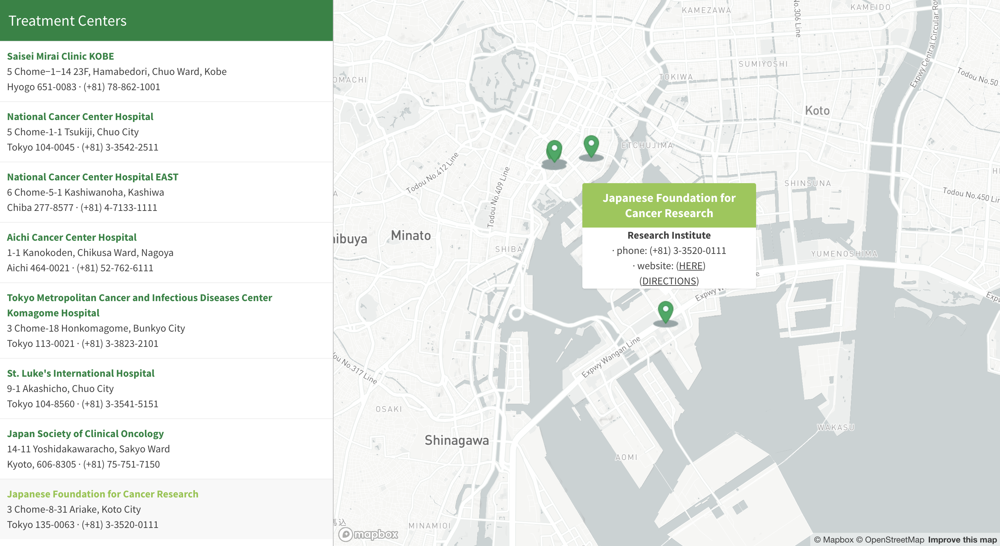

# Cancer Treatment and Hospital Locator

### Project Description
This map ([view here](https://ky-chin.github.io/japan-liver-cancer/index.html) is an interactive map that shows the location and basic information on select cancer treatment centers in Japan. The sidebar listings provide clinic names, addresses, and phone numbers.

Clicking on the markers will bring up a pop-up with the clinic classification phone number, website, and link for directions to the respective location. Clinic classification varies from general hospitals, cancer-specific centers, and research institutes. Any links will open in a new tab.

### Project Goal
The goal of this project is to provide an interactive experience for those who are seeking cancer treatment. There are many centers that span across the country, and of course there are many more that are not included in this map. The map can be expanded upon as needed, and can be adjusted to suit different needs.

### Libraries and Sources
- [Mapbox GL JS](https://docs.mapbox.com/mapbox-gl-js/api/)
- Geographic data from [Google Maps](https://maps.google.com)
- Basemap by [Mapbox](https://www.mapbox.com/)
- Icons by [icons8](https://icons8.com/icons)

### Acknowledgment
Map created following the [store locator tutorial](https://docs.mapbox.com/help/tutorials/building-a-store-locator/) by Mapbox.
This map was made as a component of a project for GEOG 280 (Introduction to the Geography of Health and Healthcare, Summer 2020) at the University of Washington, Seattle.
